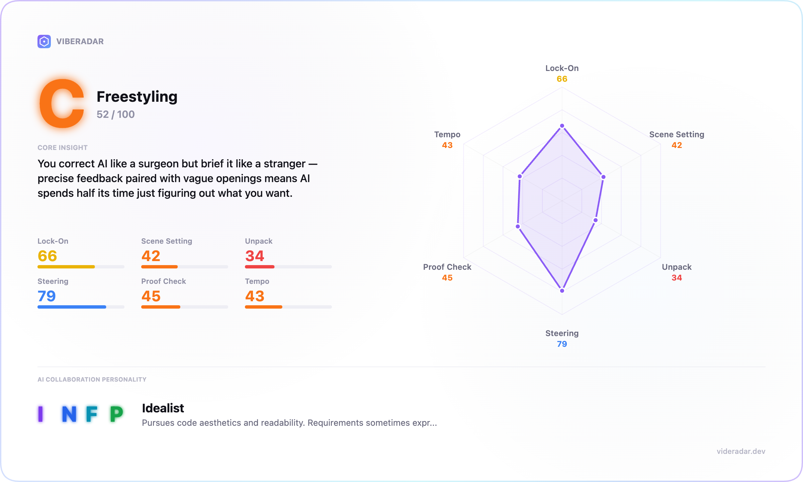

# VibeRadar



> **Somewhere in the AI cosmos, I found an old radar box. It still works.** Install it in Claude Code and see what it reveals from your sessions: it analyzes your collaboration pattern with AI across 6 dimensions, then returns an MBTI archetype and practical next-step suggestions. 100% local.

🌏 [中文版](./README_zh.md) · 📖 [Methodology](./docs/METHODOLOGY.md) · ⚖️ [License](#license)

---

## What the Report Includes

Run `/vibe-radar` and get a self-contained single-file HTML report:

**An overall grade** — S through D. One letter that shows where your AI collaboration stands today.

**6 dimension scores** — each scored 0-100 with evidence, helping you identify strengths and the parts of collaboration that still need refinement.

```
  Lock-On        78 [A]  ████████████████████
  Scene Setting  85 [S]  ████████████████████████
  Unpack         62 [B]  ██████████████████
  Steering       74 [A]  ███████████████████
  Proof Check    48 [C]  █████████████
  Tempo          71 [A]  ████████████████████
```

**Action items** — grounded in real session data and ready to apply in your next session.

**Bonus: MBTI collaboration archetype** — one of 16 profiles derived from real behavior, not surface keyword matching.

The report is delivered as a polished single-file HTML with automatic language detection and offline access.

---

## Install

```bash
git clone https://github.com/LeifDiao/vibe-radar.git ~/vibe-radar
claude --plugin-dir ~/vibe-radar
```

Clone once, then start Claude Code with `--plugin-dir` each time you want to use VibeRadar.

---

## Use

```
/vibe-radar
```

1. Pick a project from the list
2. Wait about 30 seconds
3. The report opens in your browser

After you choose a project, VibeRadar completes the analysis and opens the report automatically.

---

## Requirements

- **Claude Code** with plugin support
- **Node.js 18+** (already included with Claude Code)
- Nothing else to set up. No `npm install`, no build step, no server.

---

## Privacy

Your session data stays on your machine:

- Everything runs locally
- No data leaves your computer
- No API key, no telemetry, no cloud
- Session files are read-only from `~/.claude/projects/`
- Reports are written to `~/.vibe-radar/reports/`

---

## How Scoring Works

- **Position-aware signals** — the same signal means different things depending on where it appears. A file path in your opening message scores Scene Setting; in a correction it scores Steering.
- **Formula baseline** — deterministic and reproducible, zero run-to-run variance.
- **Bounded adjustment** — Claude's qualitative judgment, capped at ±15, must cite evidence.
- **Confidence scaling** — scores shrink toward 50 when data is sparse.

👉 [Read the full Methodology](./docs/METHODOLOGY.md)

---

## Transparent Rubric

All scoring rules live in [`data/rubric.json`](./data/rubric.json):

- Baseline formulas per dimension
- Grade thresholds (S/A/B/C/D)
- MBTI profiles (16 archetypes, bilingual)
- Confidence scaling rules

If you want the scoring to reflect your team's standards, update the file and Claude will re-read it on every run.

---

## Project Structure

```
vibe-radar/
├── .claude-plugin/plugin.json     # plugin manifest
├── skills/analyze/
│   ├── SKILL.md                   # scoring rules
│   └── scripts/
│       ├── list-projects.mjs      # scan projects
│       ├── parse-project.mjs      # signal extraction
│       └── render-report.mjs      # JSON → HTML
├── viewer/template.html           # report template
├── data/rubric.json               # formulas + profiles
└── docs/
    ├── METHODOLOGY.md             # scoring methodology
    └── METHODOLOGY_zh.md          # scoring methodology (Chinese)
```

About 200 KB. Zero dependencies.

---

## License

CC-BY-NC-4.0 — free for non-commercial use.

---

*Built for people who care about the quality of AI collaboration.*
