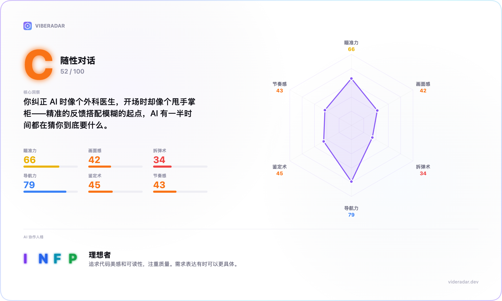

# VibeRadar



> **我在 AI 宇宙里捡到一个旧雷达盒子，它居然还能工作。** 把它装进 Claude Code 试试看，它会用 6 个维度解析你与 AI 的协作模式，再给出 MBTI 协作人格和下一步可直接使用的改进建议。全程本地运行。

🌏 [English](./README.md) · 📖 [方法论](./docs/METHODOLOGY_zh.md) · ⚖️ [协议](#license)

---

## 报告内容

运行 `/vibe-radar`，你会得到一个完整的单文件 HTML 报告：

**总评等级** — 从 S 到 D，一个字母看清你当前和 AI 配合的成熟度。

**六维雷达分数** — 每项 0-100 分，附带证据，帮助你识别稳定优势与需要优化的协作环节。

```
  瞄准力    78 [A]  ████████████████████
  画面感    85 [S]  ████████████████████████
  拆弹术    62 [B]  ██████████████████
  导航力    74 [A]  ███████████████████
  鉴定术    48 [C]  █████████████
  节奏感    71 [A]  ████████████████████
```

**行动建议** — 基于真实数据生成，可直接用于下一次会话。

**MBTI 协作人格** — 16 种类型，基于真实行为模式，而不是表面关键词。

报告以单文件 HTML 交付，自动识别系统语言，支持离线查看。

---

## 安装

```bash
git clone https://github.com/LeifDiao/vibe-radar.git ~/vibe-radar
claude --plugin-dir ~/vibe-radar
```

只需克隆一次，之后每次使用时用 `--plugin-dir` 启动 Claude Code 即可。

---

## 使用

```
/vibe-radar
```

1. 从列表中选一个项目
2. 等待约 30 秒
3. 报告自动在浏览器打开

选择项目后，VibeRadar 会自动完成分析并生成报告。

---

## 环境要求

- **Claude Code** — 支持插件的版本
- **Node.js 18+** — 安装 Claude Code 时已自带
- 除此之外什么都不用配。不用 `npm install`，不用编译，不用服务器。

---

## 隐私安全

你的会话数据始终留在本地：

- 所有计算在你的电脑上完成
- 没有数据离开你的设备
- 无 API key、无遥测、无云端
- 会话文件只读 `~/.claude/projects/`
- 报告写入 `~/.vibe-radar/reports/`

---

## 评分原理

- **位置感知信号** — 同一信号在不同位置含义不同。开场里的文件路径计入画面感，纠正里的计入导航力。
- **公式基线** — 确定性计算，零运行方差。
- **有限裁量** — Claude 定性判断最多 ±15 分，且必须引用证据。
- **置信度缩放** — 数据不足时，分数自动向 50 收缩。

👉 [阅读完整方法论](./docs/METHODOLOGY_zh.md)

---

## 公开评分规则

所有评分规则都在 [`data/rubric.json`](./data/rubric.json)：

- 每个维度的基线公式
- 等级阈值（S/A/B/C/D）
- MBTI 档案（16 种类型，中英双语）
- 置信度缩放规则

如果你希望评分标准更贴合团队习惯，只需调整这个文件；Claude 每次运行都会重新读取。

---

## 项目结构

```
vibe-radar/
├── .claude-plugin/plugin.json     # 插件清单
├── skills/analyze/
│   ├── SKILL.md                   # 评分规则
│   └── scripts/
│       ├── list-projects.mjs      # 扫描项目
│       ├── parse-project.mjs      # 信号提取
│       └── render-report.mjs      # JSON → HTML
├── viewer/template.html           # 报告模板
├── data/rubric.json               # 公式 + 档案
└── docs/
    ├── METHODOLOGY.md             # 评分原理（英文）
    └── METHODOLOGY_zh.md          # 评分原理（中文）
```

整体体积约 200 KB，零依赖。

---

## 开源协议

CC-BY-NC-4.0 — 非商业用途免费使用。

---

*为希望持续提升 AI 协作质量的人而做。*
